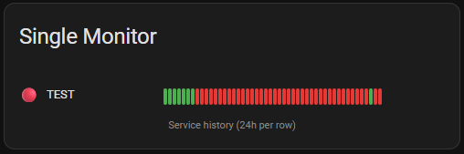
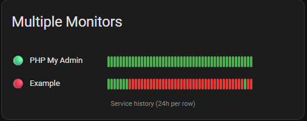

# Monitor HTTP/Service

A Home Assistant custom integration (HACS compatible) to monitor HTTP endpoints or services, with a beautiful Lovelace card for service history visualization.


## Features
- Add and monitor multiple HTTP endpoints or services
- View service history with green/red bars (up/down) in a custom Lovelace card
- Easy configuration via Home Assistant UI

## Screenshots

**Single Monitor Example**



**Multiple Monitors Example**



## Example YAML Configuration

```yaml
type: custom:monitor-http-card
name: My Monitors
entities:
	- entity: sensor.phpmyadmin
		name: PHP My Admin
	- entity: sensor.radarr_monitor
		name: Radarr
# Optional: history_length: 72 (for 3 days, default is 24)
```

Replace the entities and names with your own.

## Manual Installation
1. In Home Assistant, go to Settings → Dashboards → Resources, and add:
	 - URL: `https://cdn.jsdelivr.net/gh/minermartijn/MyMonitor@master/custom_components/mymonitor/www/monitor-http-card.js`
	 - Type: JavaScript Module
2. Add the card to your dashboard using:
	 ```yaml
	 type: custom:monitor-http-card
	 name: My Monitors
	 entities:
		 - entity: sensor.phpmyadmin
			 name: PHP My Admin
		 - entity: sensor.radarr_monitor
			 name: Radarr
	 # Optional: history_length: 72 (for 3 days, default is 24)
	 ```
	 Replace the entities and names with your own.


## Usage
### 1. Add the Integration
- Go to Home Assistant Settings → Devices & Services → Add Integration
- Search for "MyMonitor"
- Add endpoints to monitor (name, URL, method, expected status)
- Choose "Manual" if needed
- Replace `YOUR_MONITOR_NAME` with the name you gave your monitor (lowercase, spaces replaced with underscores)

## License
MIT
